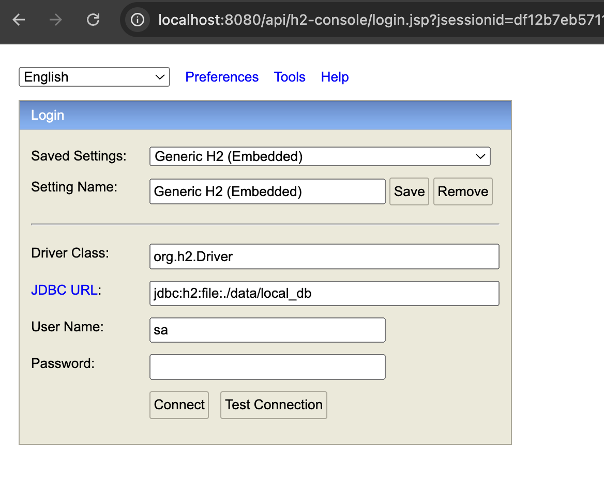
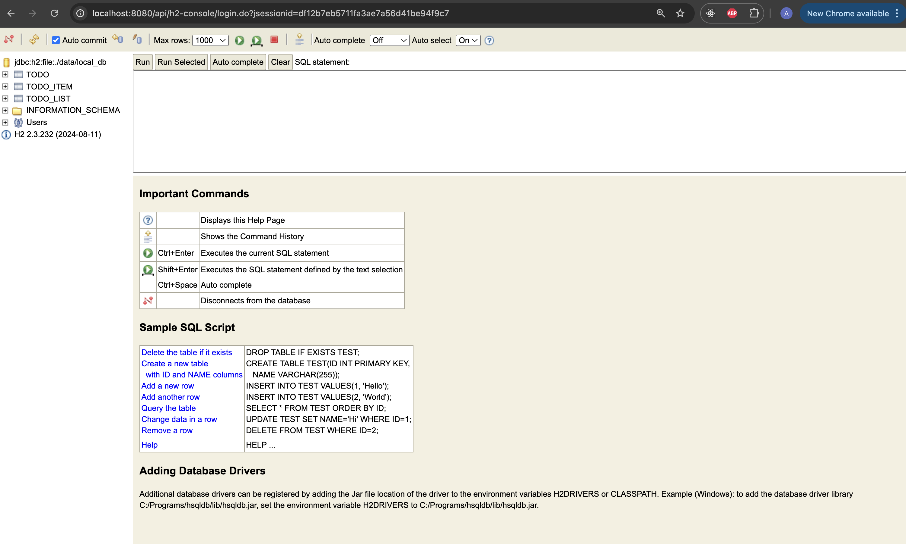
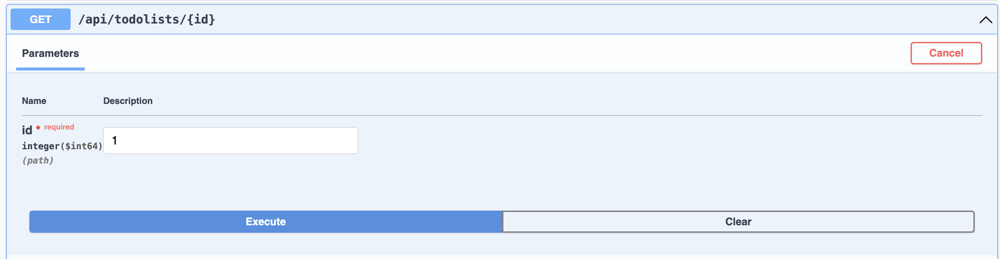
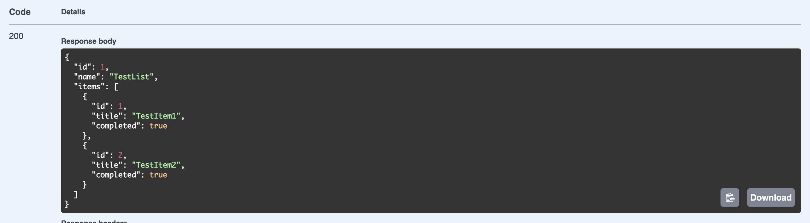

# To-Do List Backend

This is a Spring Boot backend application for a To-Do list project. It is designed for a school project and demonstrates basic CRUD operations on two entities: **TodoList** (a container of to-do items) and **TodoItem** (an individual task). The project uses an H2 file-based database for local persistence and includes endpoints for managing lists and their items. It also leverages Spring Security, Spring Data JPA, and Lombok for reduced boilerplate code.

## Table of Contents

- [Prerequisites](#prerequisites)
- [Getting Started](#getting-started)
- [Project Configuration](#project-configuration)
- [Folder Structure](#folder-structure)
- [How to access the H2 (SQL database) console](#accessing-the-h2-console)
- [Swagger/OpenAPI Documentation for API Testing](#swaggeropenapi-documentation)

## Prerequisites

- **Java 17** – Ensure you have a JDK 17 installed.
- **Gradle** – This project uses Gradle (Groovy DSL). The Gradle Wrapper is included, so you don’t have to install Gradle separately.

## Getting Started
- To **build** the project run the following command:
```
./gradlew build
```

- To **run** the project run the following command:

```
./gradlew bootRun // For Mac users
gradle.bat        // For Windows users
```

- This will run the project at http://localhost:8080/api/

## Project Configuration
- **Gradle (Groovy DSL)** manages dependencies and builds.
- **Spring Boot v3.4.3** with jar packaging.
- **Key Dependencies**:
  - Spring Boot Starter Web (For easy CRUD operations)
  - Spring Boot Starter Data JPA (ORM to link Java classes/entities to SQL tables)
  - Spring Boot Starter Security (Built in security)
  - Lombok (to reduce boiler plate), for examples look for '@setter' '@getter' in the project
  - H2 Database (lightweight simple file based SQL database)
  - OpenAPI with Swagger UI (for easy testing of API endpoints)

## Folder Structure
```
server
├── src
│   ├── main
│   │   ├── java
│   │   │   └── com
│   │   │       └── cpsc559
│   │   │           ├── ServerApplication.java         # Main application class
│   │   │           ├── controller                     # REST Controllers
│   │   │           │   ├── TodoListController.java
│   │   │           │   └── TodoItemController.java
│   │   │           ├── model                          # Domain models/entities
│   │   │           │   ├── TodoList.java
│   │   │           │   └── TodoItem.java
│   │   │           ├── repository                     # JPA repositories
│   │   │           │   ├── TodoListRepository.java
│   │   │           │   └── TodoItemRepository.java
│   │   │           └── security                       # Security configuration
│   │   │               └── SecurityConfig.java
│   │   └── resources
│   │       └── application.properties               # Application configuration
├── build.gradle                                     # Gradle build file (Groovy DSL)
├── gradlew                                          # Gradle wrapper for macOS/Linux
├── gradlew.bat                                      # Gradle wrapper for Windows
└── README.md                                        # This file
```

## Contribution Guidelines
Let's say you wanted to add a way to store/retrieve and manipulate user information. You would:
1) Making the model: Create a UserModel.java class in the **/model** folder. Ensure it is prefixed with @entity.
   - This makes it so that a user table is automatically created when running your applicaiton.
   
Example: This automatically creates a User table with Id and Name fields.
```
@Entity
public class User {

@Setter
@Getter 
@Id
@GeneratedValue(strategy = GenerationType.IDENTITY)
private Long id;

@Setter
@Getter 
private String name;
...
}
```

2) Making the repository: Create a UserRepository.java class in the **/repository** folder.
   - This just creates an interface that will be implemented in our controllers.
   - We don't need to define any methods as it extends **JpaRepository**.

Example:
```
public interface UserRepository extends JpaRepository<TodoItem, Long> {
    // Spring Data JPA will automatically implement common CRUD methods.
}
```

3) Making the controller: Create a UserController.java class in the **/controller** folder.
   - Ensure it is tagged with @RestController, and a @RequestMapping route
   - This is where we will define our CRUD operations in terms of HTTP requests (GET, PUT, POST, DELETE)

Example:
```
@RestController // Tells Springboot this is where some requests will be handled                                                
@RequestMapping("/api/users") 
public class UserController {

    @Autowired
    private UserRepository userRepository;

    // POST /api/users/register - Register a new user
    @PostMapping("/register") 
    public ResponseEntity<?> registerUser(@RequestBody User user) {
        if (userRepository.existsByUsername(user.getUsername())) {
            return ResponseEntity.badRequest().body("Username is already taken");
        }
        // Save the user to the database
        User savedUser = userRepository.save(user);
        return ResponseEntity.ok(savedUser);
    }

    // GET /api/users/{id} - Get user details by ID
    @GetMapping("/{id}")
    public ResponseEntity<User> getUserById(@PathVariable Long id) {
        User user = userRepository.findById(id)
            .orElseThrow(() -> new RuntimeException("User not found with id: " + id));
        return ResponseEntity.ok(user);
    }
}
```

## Accessing the H2 Console
1. **Start** the application.
2. In your browser go to http://localhost:8080/api/h2-console
3. Use the following connection details:
   - **JDBC URL**: jdbc:h2:file:./data/local_db
   - **User Name**: sa
   - **Password**: (leave blank)
4. Click **Connect**

Example:


5. You should now be able to see a console like this where you can perform queries.



6. The data is stored in file format at **server/data**

## Swagger/OpenAPI Documentation
Swagger UI can be accessed at http://localhost:8080/api/swagger-ui/index.html

This is basically a tool which allows you to make HTTP requests to this running server and see the responses.
So, you can test the backend independently of the frontend.

### Example: Getting a to-do list by id
#### 1) After clicking 'Try it out', fill in any parameters/request body details.
#### 2) Click Execute


#### 3) Scroll down to see the response

